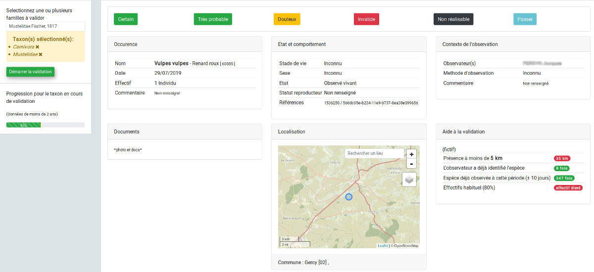

# Validation OBO (OneByOne)
Module validation "une par une" et collegiale

Module de validation collégiale (2 validateurs doivent choisir le même statut) pour GéoNature.
Le validateurs choisi le taxon, en général une famille ou un ordre (paramétrable depuis une liste Taxhub).

